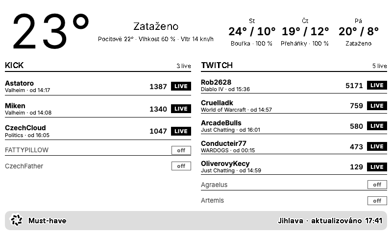

# TRMNL Must-have

One screen for a [TRMNL](https://trmnl.com) e-ink display (800×480): local weather plus the live status of the
Kick and Twitch streamers you follow (online/offline, viewers, category, start time).

The collector is plain Python 3.12 (standard library only). It runs on a timer, fetches the data and pushes it to a
TRMNL private plugin. TRMNL renders the screen from the Liquid templates in `templates/`.

Česká verze: [README.cs.md](README.cs.md)



## Data sources (no API keys required)

| Source | How |
| --- | --- |
| Weather | [Open-Meteo](https://open-meteo.com), coordinates from `config.toml` |
| Kick | unofficial `kick.com/api/v2/channels/<slug>` endpoint |
| Twitch | the public GraphQL endpoint the twitch.tv website uses (Client-ID read from the page, refreshed automatically), fallback [decapi.me](https://decapi.me) |

No Twitch or Kick developer application is needed.

## Configuration

`config.toml` holds the city, coordinates, the streamer lists and the send cadence. Streamers are plain string arrays;
edit the file and redeploy. Host-specific values (`[server] port`, `label`, `headless`) go into a git-ignored
`config.local.toml` next to it, which overrides the same tables and is never overwritten by `deploy/install.sh`.

```toml
[streams]
kick = ["fattypillow", "czechfather", "astatoro", "miken", "czechcloud"]
twitch = ["arcadebulls", "agraelus", "artemis", "cruelladk", "conducteir77", "oliverovykecy", "rob2628"]

[trmnl]
plugin_setting_id = 479481   # numeric id of your private plugin instance
```

Secrets never live in the repo. The collector reads them, in this order of precedence, from the environment,
from a git-ignored `.env` file in the project root, or (macOS) from the Keychain:

| Variable | Purpose |
| --- | --- |
| `TRMNL_USER_API_KEY` | user API key (trmnl.com → Account). Used with `plugin_setting_id` to push data through the authenticated API and for `status`. |
| `TRMNL_WEBHOOK_UUID` | alternative: the UUID from the plugin's Webhook URL. If set, it is preferred and no API key is needed. |

Keychain entry: `security add-generic-password -s trmnl-musthave -a TRMNL_USER_API_KEY -w <key>`.

## Creating the private plugin

Everything can be done through the API with the user key (the TRMNL UI works too):

```bash
# 1. create the instance (plugin_id 37 = Private Plugin); note the returned id
curl -X POST https://trmnl.com/api/plugin_settings -H "Authorization: Bearer $TRMNL_USER_API_KEY" \
  -H "Content-Type: application/json" -d '{"plugin_id":37,"name":"Must-have"}'
# 2. upload strategy + templates as a zip archive (settings.yml with `strategy: webhook` + the .liquid files)
deploy/push_plugin.sh <id>
# 3. put the id into config.toml → [trmnl] plugin_setting_id
# 4. add the plugin to your device playlist (TRMNL UI → Playlists) and run once
python3 -m musthave run
```

## Commands

```
python3 -m musthave run            # fetch + push (respects the rate limits)
python3 -m musthave run --dry-run  # print the payload, send nothing
python3 -m musthave fetch          # JSON only
python3 -m musthave status         # devices on the account (needs TRMNL_USER_API_KEY)
uv run --with pytest pytest -q     # tests (no network)
uv run --with python-liquid preview/render.py --layout full   # local preview → preview/out.html
```

## Rate limits

TRMNL allows 12 pushes per hour (30 with TRMNL+) and a 5 kB payload. The collector runs every 5 minutes and
sends when the data changed (at most 12 pushes/hour) or as a heartbeat after 15 minutes. TRMNL re-renders a
private plugin no faster than every 15 minutes (`refresh_interval: 15` in settings.yml, in minutes, is the minimum
without TRMNL+; 5 and 10 get rounded up), so the device refresh is set to 15 minutes too. The payload is about 1.1 kB for 12 streamers; category names are shortened first and the
run fails loudly above 4.5 kB.

## BYOS mode: 5-minute updates without the TRMNL cloud

TRMNL re-renders a private plugin at most every 15 minutes unless you pay for TRMNL+. To update the screen every
5 minutes, run the built-in BYOS server instead and point the device at it. The server renders the same Liquid
template locally (headless Chrome → 1-bit PNG) and serves the three endpoints the firmware expects
(`/api/setup`, `/api/display`, `/api/log`). If a fetch or render fails, the previous image stays and the device
does not redraw (the `filename` does not change). The server still pushes data to the TRMNL cloud, so switching
back is a soft reset away.

```bash
uv venv .venv && uv pip install -p .venv/bin/python -r requirements-server.txt   # python-liquid + Pillow
.venv/bin/python -m musthave serve --once     # test render → state/screen/current.png
deploy/install_server_launchd.sh              # macOS: launchd agent with KeepAlive (replaces the collector agent)
```

Point the device at the server: hold the button on the back for 5 s, join the `TRMNL` Wi-Fi, in the captive
portal open **Advanced → Custom Server → Yes**, enter `http://<LAN-IP>:8080` (no trailing slash), then your Wi-Fi
credentials and Connect. Give the host a fixed LAN IP (DHCP reservation). Back to trmnl.com: pairing mode →
Advanced → Soft Reset, and clear the server field. `[server]` in `config.toml` sets port, refresh, image format
(`png` or `bmp`) and an explicit Chrome path. On a Raspberry Pi use `deploy/trmnl-musthave-server.service`
(`apt install chromium`).

## Protocol v1 (custom firmware)

With the [trmnl-musthave-firmware](https://github.com/JirakJ/trmnl-musthave-firmware) fork the device sends
`X-Frame-Id` (the frame it currently shows) and the server answers with `action: none | partial | full`. For
`partial` it serves `/frames/<id>.regions?from=<old>`: a small binary blob (`MHR1`) with up to 4 changed rectangles,
each carrying the old and new 1-bit pixels, so the panel refreshes only those windows without flashing. The server
also decides `sleep_mode` (light on USB, deep on battery, from the reported voltage), `refresh_rate`, when to do a
full refresh against ghosting (`full_after_partials`, `full_every_minutes`, `night_full_at`) and offers OTA from
`deploy/firmware/latest.bin` when `firmware_version.txt` differs from the device's version. Stock firmware keeps
working against the same server (it always takes the `full` path). See `docs/superpowers/specs/2026-09-16-custom-firmware-partial-refresh-design.md`.

## Deploying to a Raspberry Pi

```
deploy/install.sh [ssh-host]      # rsync to ~/trmnl-musthave + systemd timer (5 min); copies .env if present
ssh rpi journalctl -u 'trmnl-musthave@*' -n 20
```

## Layout

```
musthave/   config, http, weather, kick, twitch, payload, state, trmnl (push clients), run,
            screen (render) + frames + diff + policy + devices + server + serve (BYOS v1), __main__
templates/  full / half_horizontal / half_vertical / quadrant .liquid
preview/    render.py, sample.json (real payload), screenshots
deploy/     systemd units + timer, install.sh, push_plugin.sh, launchd plists, BYOS server unit
tests/      pytest with fixtures captured from the real APIs
docs/superpowers/  design spec and implementation plan (Czech)
```

## License

MIT
